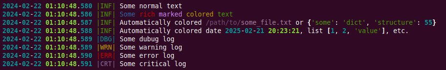

# Rich Logger

## Overview
This custom logger extends Python's built-in logging module by integrating with the rich library to provide a more visually appealing and informative logging experience. The logger is designed to be easy to use while offering advanced features like millisecond precision in timestamps and color-coded log levels for better readability.

---
## Features
Rich Formatting: Utilizes rich.console.Console for enhanced formatting.  
Millisecond Precision: Custom formatter to include milliseconds in log timestamps.  
Color-Coded Log Levels: Different colors for each log level for easy distinction.  
Level Name Shortcuts: Abbreviated log level names for compact and clear logs.  
Customizable: Easy to integrate and customize in any Python project.  

---
## Installation
Before using the custom logger, ensure you have the rich library installed. If not, you can install it using pip:
```commandline
pip install rich
```

---
## Usage
To use the custom logger in your Python application, simply import and instantiate RichLogger.  
### Example:
```python
from logger.main import RichLogger

logger = RichLogger()


logger.info("Some normal text")
logger.info("[blue]Some [red]rich [violet]marked[not violet] [yellow]colored [green]text[/]")
logger.info("Automatically colored /path/to/some_file.txt or {'some': 'dict', 'structure': 55}")
logger.info("Automatically colored date 2025-02-21 20:23:21, list [1, 2, 'value'], etc.")

logger.debug("Some dubug log")
logger.warning("Some warning log")
logger.error("Some error log")
logger.critical("Some critical log")


```
### Output example:
